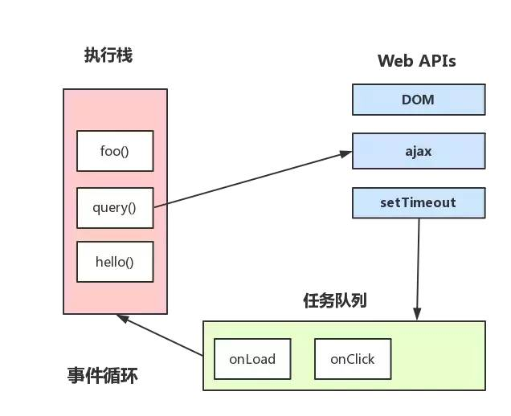

##### 进程与线程

> - 进程是系统分配的独立资源，是CPU资源分配的基本单位，进程是由一个或者多个线程组成的
> - 线程是进程的执行流，是CPU调度和分派的基本单位，同个进程之中的多个线程之间是共享该进程的资源的

##### 浏览器内核

> 浏览器是多进程的，浏览器每一个tab标签都代表一个独立的进程（多个空白tab标签会合并成一个进程），浏览器内核（渲染进程）属于浏览器多进程的一种
>
> 浏览器内核有多种线程在工作
>
> - GUI渲染线程
>   - 负责渲染页面，解析HTML、CSS和构成DOM树等，当页面重绘或者由于某种操作引起回流都会调起该线程
>   - 该线程与JS引擎线程互斥，当JS引擎线程在工作的时候，GUI渲染线程会被挂起，GUI更新被放入在JS任务队列中，等待JS引擎线程空闲的时候继续执行
> - JS 引擎线程
>   - 单线程工作，负责解析运行JavaScript脚本
>   - 和GUI渲染线程互斥，JS运行耗时过长就会导致页面阻塞
> - 事件触发线程
>   - 当事件符合触发条件被触发时，该线程会把对应的事件回调函数添加到任务队列的队尾，等待JS引擎处理
> - 定时器触发线程
>   - 浏览器定时计数器并不是由JS引擎计数的，阻塞会导致计时不准确
>   - 开启定时器触发线程来计时并触发计时，及时完成后会被添加到任务队列中，等待JS引擎处理
> - HTTP请求线程
>   - http请求的时候会开启一条请求线程
>   - 请求完成由了结果之后，将请求的回调函数添加到任务队列中，等到 JS 引擎处理


> JS是单线程的，单线程就意味着多任务的时候前面的任务会阻塞后面的任务，如果我们发出一个网络请求，那么在等待响应的过程中，后面的任务都会造成阻塞，也就意味着用户的其他操作没响应，这是非常不好的。为了解决这些问题，我们引入了同步任务和异步任务，JS遇到同步任务会执行该同步任务，后面的任务必须等待；遇到异步任务的时候，我们将其挂起，在等待该任务执行完毕的期间，我们可以继续执行后面的任务，等到挂起的异步任务有响应的时候，我们将他们放到一个队列中，执行栈中任务执行完毕之后，就会去这个队列中读取要执行的任务。如此循环读取的过程就叫做事件循环
>
> 


一开始的发展过程中（ES3及以前的版本），JS本身并没有实现异步，异步的实现都要靠宿主（浏览器/Node）来实现。后来，JavaScript引入了promise，这样子，JS引擎本身也可以发起异步任务了。通常，我们把宿主发起的任务成为宏观任务（Macro Task），把JavaScript引擎发起的任务成为微观任务（Micro Task）

常见的宏观任务有：setTimeout、setInterval、I/O、UI  rendering，即：定时器、I/O事件、网页渲染

常见的微观任务有：Promise、Mutation Observer

一个事件循环的过程可能如下：

- 选择任务进入执行栈中执行，比如一开始加载的script脚本
- 遇到同步任务，阻塞并执行，执行完毕之后再放开阻塞，遇到异步任务，挂起该异步任务并继续执行后面的代码，继续执行到执行栈为空
- 执行栈为空之后，查看微任务队列是否为空，如果不为空，则取出微任务队列的任务到执行栈并执行
- 执行栈再次为空之后，继续到微任务队列查看是否有任务，如果没有，则查看是否有宏观任务，如果有宏观任务，则取出来并执行之。


栗子：

```js
console.log('script start')

setTimeout(function () {
    console.log('setTimeout')
}, 0)
Promise.resolve().then(function () {
    console.log('promise1')
}).then(function () {
    console.log('promise2')
})
console.log('script end')
// 输出顺序为：
// script start   scriptend  promise 1  promise 2   setTimeout
```

1. 加载代码，执行代码
2. 遇到同步代码，执行，输出：`script start`
3. 遇到异步代码，将该异步代码添加到宏观任务队列
4. 遇到异步代码，添加到微观任务队列
5. 遇到同步代码，执行，输出  `script end`
6. 执行栈为空，到任务队列中查看是否有要执行的任务，先看微观任务队列，微观任务队列中有一个任务，取出该任务到执行栈中，执行，输出：`promise1`,同时隐式调用resolve，添加一个异步任务到微观任务队列
7. 执行栈为空，到任务队列中查看是否有要执行的任务，先看微观队列，微观队列中有一个任务，取出该任务到执行栈中，执行，输出： `promise2`
8. 执行栈为空，到任务队列中查看是否有要执行的任务，先看微观队列，微观队列为空，则看宏观队列，宏观队列中有一个任务，取出来放到执行栈中执行
9. 执行栈为空，再查看队列任务中是否有任务，有则执行，无则过一定时间后再次检查，如此循环，便是事件循环

栗子二、

```js
console.log('script start')

async function async1() {
  await async2()
  console.log('async1 end')
}
async function async2() {
  console.log('async2 end')
}
async1()

setTimeout(function() {
  console.log('setTimeout')
}, 0)

new Promise(resolve => {
  console.log('Promise')
  resolve()
})
  .then(function() {
    console.log('promise1')
  })
  .then(function() {
    console.log('promise2')
  })

console.log('script end')
// 输出顺序为：
// script start   async2 end  Promise  script end async1 end  promise1  promise2  setTimeout
```

分析：

1. `console.log('script start')`  同步，立即输出  `script start`
2. `async1()`  运行`async1`函数，执行第一个`await`的函数  `async2()`，await之后的代码`console.log('async1 end')` 被放到宏任务队列中
3. 执行`async2()`  中的`console.log('async2 end')`  输出`async2 end`
4. 立即执行的setTime函数，立即被添加到宏任务队列中
5. 执行promise中的console.log('Promise')，`resolve()`之后将第一个then函数放入到微任务队列
6. `console.log('script end')`  ,  同步代码，立即输出
7. 检查微任务队列，此时微任务队列中有`console.log('async1 end')` 和`console.log('promise1')` 两个先后被添加到队列中的任务，根据队列中先进先出的特征，先执行第一个，输出`async1 end`
8. 取出第二个微任务队列中的任务，输出`async2 end` ,同时添加一个微任务到微任务队列中
9. 取出微任务队列中的任务，输出`promise2`
10. 微任务队列为空，到宏任务队列中查看，此时有待执行setTimeout函数，取出来到执行栈中执行，输出`setTimeout`

浏览器和Node环境下，microtask的执行时机不一样

- Node端，microtask在事件循环的各个阶段执行
- 浏览器端，microtask 在事件循环的macrotask执行完之后执行

Node11之后，Node的Event Loop 运行原理发生变化，一旦执行一个阶段里的宏任务，就立刻执行为任务队列，与浏览器端一致


参考：

[一次弄懂Event Loop（彻底解决此类面试问题）](<https://juejin.im/post/5c3d8956e51d4511dc72c200>)

[JS浏览器事件循环机制](<https://segmentfault.com/a/1190000015559210>)

