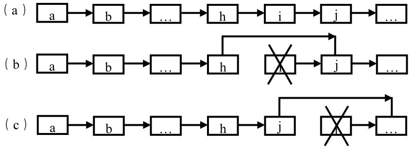

> 给定单向链表的头指针和一个结点指针，定义一个函数在O(1)时间删除该结点。链表结点与函数的定义如下
>
> ```cpp
> struct ListNode {
>     int m_nValue;
>     ListNode* m_pNext;
> };
> void DeleteNode(ListNode** pListHead, ListNode* pToBeDeleted);
> ```


常规的解法：

- 从头节点开始遍历，一直遍历到要删除的结点的前一个结点
- 此时将该结点的下一个指针指向要删除的结点的下一个结点
- 删除目标结点，此时的时间复杂度是`O(1)`



优化的解法：

- 目标结点的下一个结点覆盖目标结点
- 删除目标结点的下一个结点
- 边界处理：
  - 如果目标结点是尾结点，则删除尾结点
  - 如果链表中只有一个结点，直接将头节点设为NULL

编码实现

```cpp
void DeleteNode(ListNode** pListHead, ListNode* pToBeDeleted){
    if (!pListHead || !pToBeDeleted) {
        return;
    }
    // 要删除的结点不是尾节点
    if (pToBeDeleted->m_pNext != NULL) {
        ListNOde* pNext = pToBeDeleted->m_pNext;
        pToBeDeleted->m_nValue = pNext->m_nValue;
        pToBeDeleted->m_pNext = pNext->m_pNext;
        delete pNext;
        pNext = NULL;
    }
    // 链表只有一个结点，删除头结点（也是尾节点）
    else if (*pListHead == pToBeDeleted) {
        delete pToBeDeleted;
        pToBeDeleted = NULL;
        *pListHead = NULL;
    }
    else { // 链表中有多个结点，且删除的是尾节点
        ListNode* pNode = *pListHead;
        while (pNode->m_pNext != pToBeDeleted) {
            pNode = pNode->m_pNext;
        }
        pNode->m_pNext = NULL;
        delete pToBeDeleted;
        pToBeDeleted = NULL;
    }
}
```

时间复杂度：

顺序查找：`O(n)`，覆盖：`O(1)`

总的平均时间复杂度：`[(n-1)*O(1)+O(n)]/n`